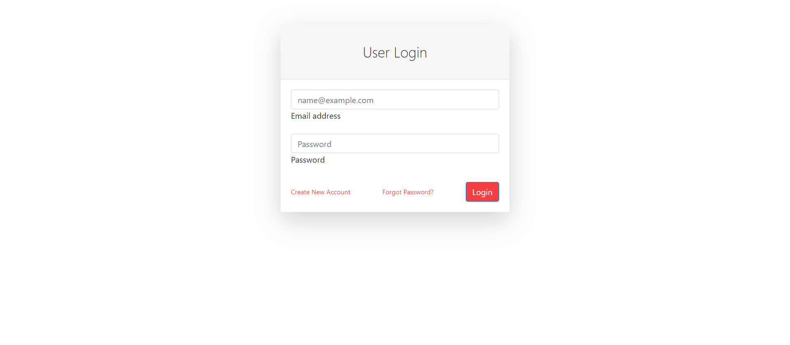
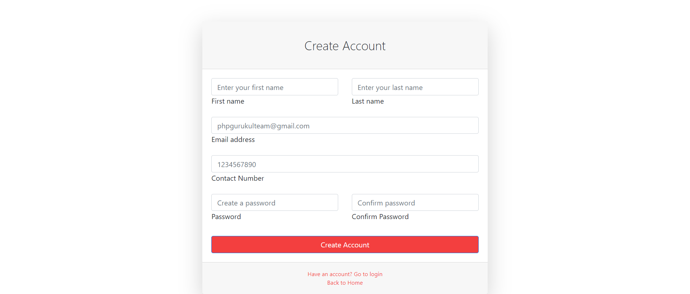
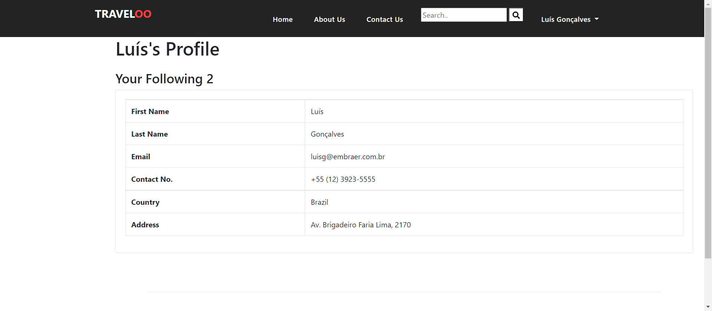
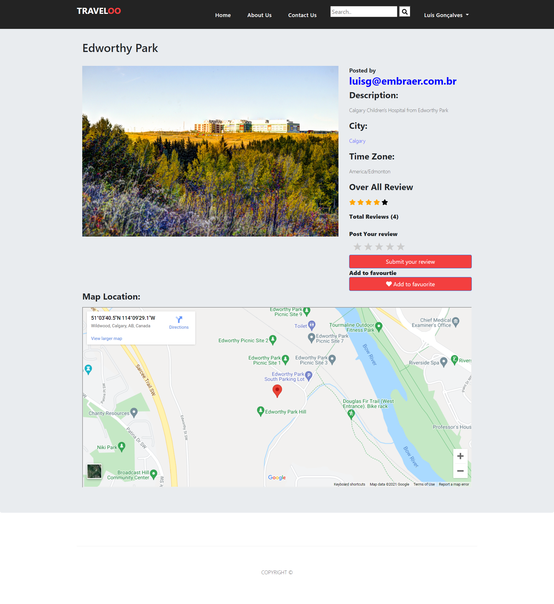
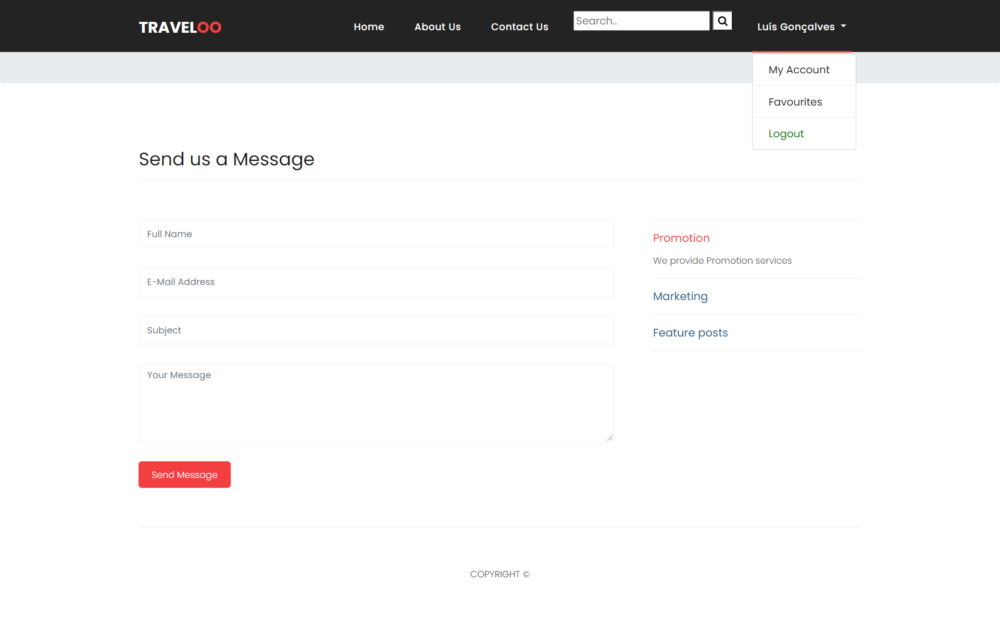
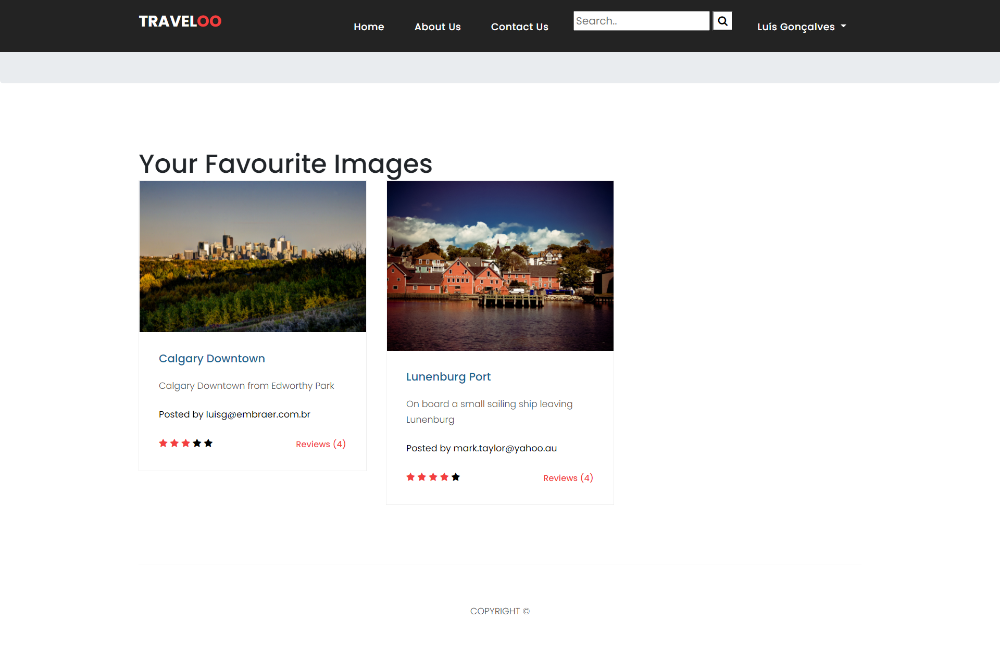
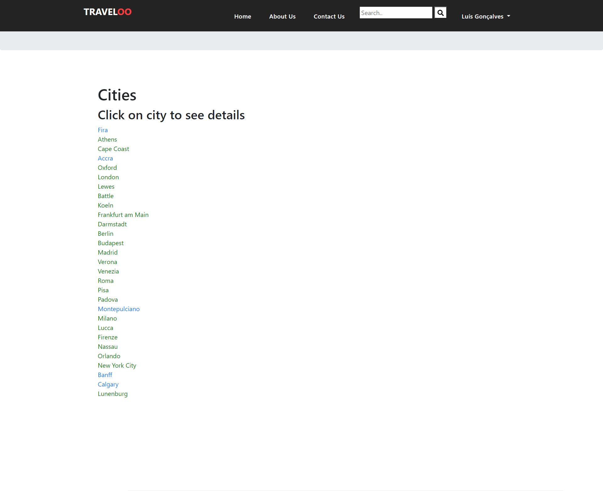
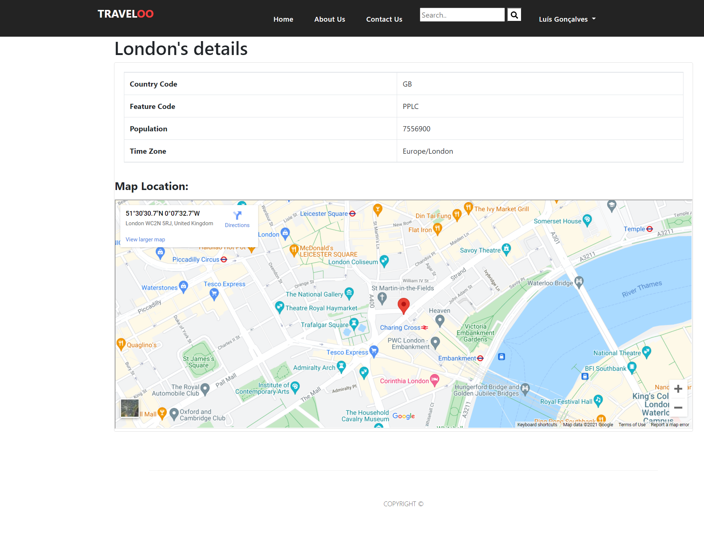
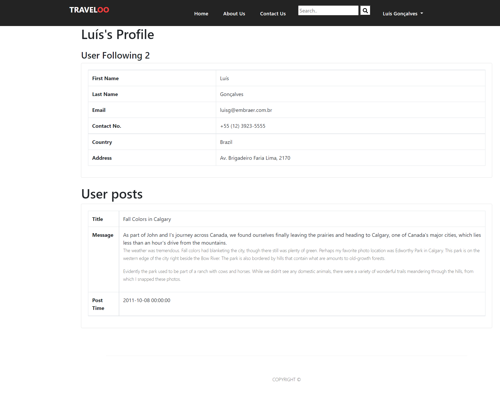

# To Run

To run this project, first place the root folder in htdocs, and open it in local hsot
Remember you need travel.sql database running in xampp.

# Details
Travel Photo sharing social network.
- User can post reviews and see reviews to images posted bu other users
- user can search posts
- User can login and register
- User can see other user posts and details
- user can see cities data

# Detabase design

# Some visuals

- Main page:

- Login page:

- Register page:

- After login page:

- My account page:

- Single post page :

- About us page :

- Contact us page :

- Favourite images  page :

- Cities  page :

- Single Citypage :

- Single User Page :

